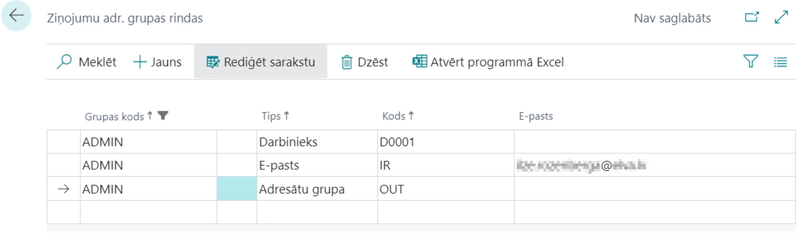
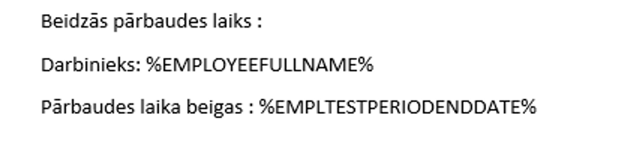
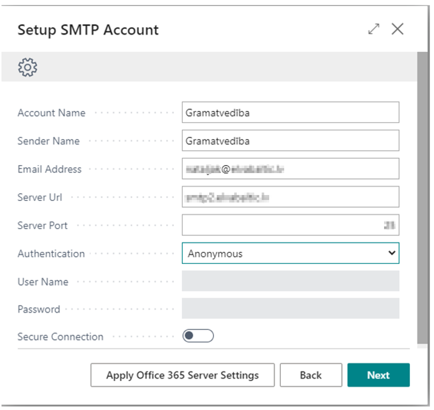
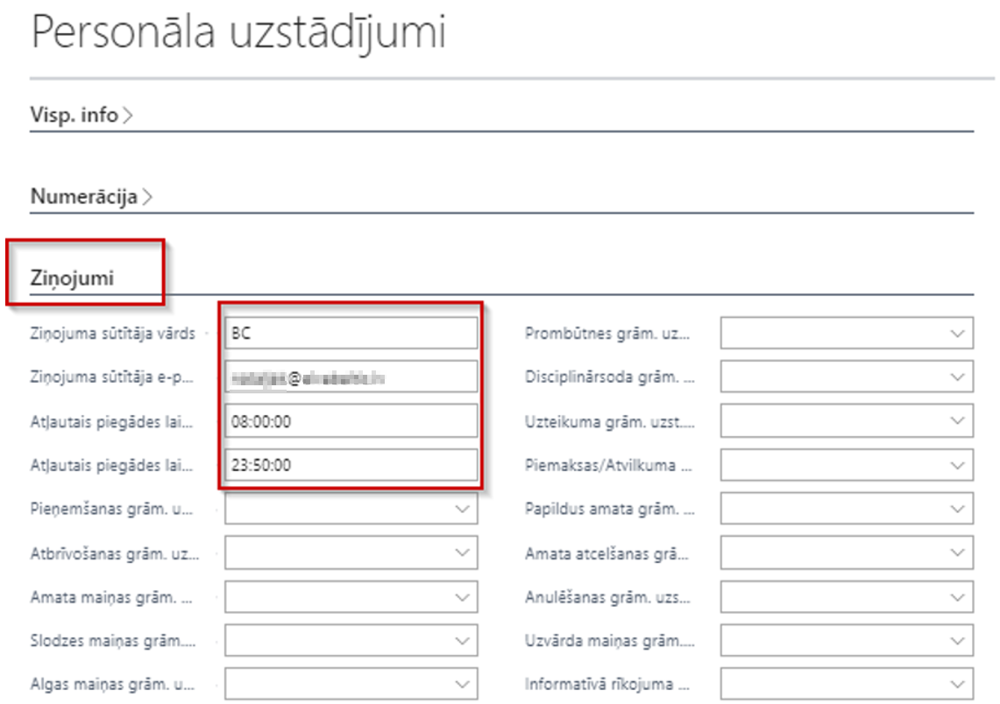
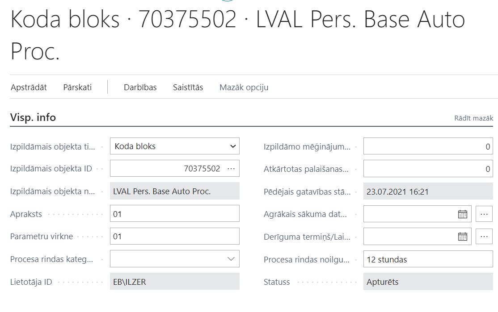

# Ziņojumu veidošana

Sistēmā ir iespējams automātiski sagatavot un informēt darbiniekus par uzņēmumā svarīgiem notikumiem, kā arī papildus iespējams pārskatīt nosūtīto ziņojumu vēsturi.

Visi izveidotie ziņojumi pieejami atverot sarakstu *Ziņojumi*.
## Ziņojumu adresātu grupas

Lai nevajadzētu katru reizi jaunam ziņojumam, kas attiecas tikai uz kādu konkrētu saņēmēju loku, pievienot adresātus pa vienam, ir iespējams izveidot adresātu grupas. Atveriet sarakstu *Ziņojumu adresātu grupas*. Izveidojiet jaunu rindiņu jaunai grupai un caur pogu *Rindas* piesaistiet adresātus.

Ziņojumu adresātu grupas rindas satur sekojošus laukus:
-	Grupas kods – no adresātu grupas klasifikatora, veido pats lietotājs;
-	Tips – adresātu grupa vai darbinieks;
-	Kods – adresātu grupas kods vai darbinieka numurs (ja noradām e-pastu, var vienkārši ierakstīt kaut ko);  
-	E-pasts – aizpildīts tikai gadījumā, ja ziņojums sūtīts cilvēkam, kurš nav uzņēmuma darbinieks.

Adresātu grupas rindā ir iespējams definēt darbinieku vai citu adresātu grupu. Šādā veidā iespējams no mazākām grupām veidot lielākas ziņojumu grupas, kas apvieno dažādus darbiniekus. Adresāta e-pasts tiks paņemts no visiem adresātu grupu hierarhijā esošajiem darbiniekiem.

## Ziņojumu notikumu uzstādījumi

Papildus jāaizpilda *Ziņojuma notikumu uzstādījumi*, kas satur sekojošus laukus:
-	Kods – ziņojuma kods;
-	Nosaukums;
-	Automātiskā procesa tips – jānorāda gadījumā, ja tiek konfigurētas procesa rindas, tas ir  automātiskā nosūtīšana par definētiem notikumiem ( dzimšanas dienas, pases termiņš u.c.). Ja procesa rindas netiek konfigurētas, nekas nav jāaizpilda. 
-	Adresātu grupas kods – no adresātu grupas klasifikatora;
-	Sūtīt pašam darbiniekam;
-	Sūtīt struktūrvienības vadītājam;
-	Pēdējā ziņojuma datums;
-	Datuma formula – obligāti jābūt definētai, ja ziņojumam norādīts automātiskā procesa tips;
-	1. datuma formula - obligāti jābūt definētai, ja ziņojumam norādīts automātiskā procesa tips;
-	2. datuma formula - obligāti jābūt definētai, ja ziņojumam norādīts automātiskā procesa tips;
-	Veidnes kods – ziņojuma veidne. 
-	Nepieciešama apstiprināšana;
-	Apstiprināšanas adresātu grupas kods;
-	Prombūtnes filtrs – tiek norādīts prombūtnes kods, ja jāziņo tikai par kādu konkrētu prombūtni (sākuma un beigu datumiem).

## Ziņojuma veidne

Jāizveido jaunas veidnes kods sarakstā *Ziņojumu veidnes*.
Jāsagatavo MS Word dokuments, kurā sagatavots ziņojuma teksts. Mainīgā teksta vietā ierakstīt mainīgā dokumenta lauka kodu ar procentiem. Piemēram:

**Jāpievērš uzmanība, ka locījumi nav pieejami.** Dokumentu laiku nosaukumi ir pieejami pie konkrētā ziņojuma veida sarakstā *Ziņojumu notikumu uzstādījumi*, noklikšķinot uz pogas *Dokumentu lauki*.

Sagatavotu failu saglabājiet ar paplašinājumu *Web Page, Filtered (.htm,.html)*

## Uzstādījumi ziņojumu nosūtīšanai e-pastā

Lai ziņojumus varētu izsūtīt ar e-pastu starpniecību, ir nepieciešams veikt zemāk minētos uzstādījumus E-pastu kontos un Personāla uzstādījumos:

**E-pasta Konts**

Nepieciešams izveidot e-pasta kontu. Sistēmas meklētājā ierakstiet *E-pastu Konti* un izvēlieties to no saraksta. Lai izveidotu jaunu kontu, jānospiež pogas *Jauns* - *Pievienot e-pasta kontu*. Lai sūtītu e-pastus, no algas moduļa jāizvēlas Konta tips *SMTP - Use SMTP to send emails*.

Aizpildiet SMTP uzstādījumus:

Nākamajā solī var pārbaudīt e-pastu , kā arī iestatīt šo kontu kā noklusēto:

**Personāla uzstādījumi**

Ziņojumiem ir nepieciešams salikt sekojošos uzstādījumus katalogā *Personāla uzstādījumi*:

## Lietotāju uzstādījumi

Lapā *Lietotāju uzstādījumi* priekš Personāla risinājuma vajadzībām nepieciešams aizpildīt tikai lauku *Lietotā ID* jeb sistēmas lietotāja ID;

Pārējie lauki šim risinājumam nav aktuāli.

## Procesa rinda

Procesu rindas veido sarakstā *Procesu rindu ieraksti*.
Katram atsevišķam notikum jāizveido sava procesu rindas ieraksta karte, norādot *Izpildāmā objekta ID* - 70375502

*Procesa rindas ieraksti* kartes cilnē *Visp. info* var redzēt notikuma veidu, kuram var definēt periodiskumu. Jāpievērš uzmanība, ka laukiem *Apraksts* un *Parametru virkne* jābūt vienādiem. Lai definētu pašu notikumu, lietotājam ir jābūt MS Business Central programmēšanas zināšanām. 

Cilnē *Periodiskums* definē ziņojumu sūtīšanas intervālu. Šo lietotājs var definēt pats. Definējot periodiskumu ir jāpievērš uzmanība, lai minūšu skaits no vienas izpildes līdz otrai  nav mazāks par vienu reizi, kas nepieciešams ziņojuma apstrādei.

**Lai varētu izsūtīt izveidotos ziņojumu, sistēmai ir nepieciešams, lai Procesu rindas ierakstos būtu izveidota atsevišķa procesu rinda ar kodu *MSGSEND*, ko ieraksta laukos *Apraksts* un *Parametru virkne***

 
Izsūtīto ziņojumu vēsturi par konkrētiem notikumiem var apskatīties *Procesa rindas žurnāla ierakstos*. Žurnāls satur sekojošus laukus:

-	Statuss – kurā notikums atrodas uz pārbaudes brīdi - veiksmīgi, notiek, kļūda;
-	Lietotāja ID – kurš ir palaidis šo notikuma procesu;
-	Izpildāmais objekta nosaukums;
-	Sākuma datums/Laiks;
-	Beigu datums/Laiks;
-	Kļūdas ziņojums – ja statuss ir kļūda.

